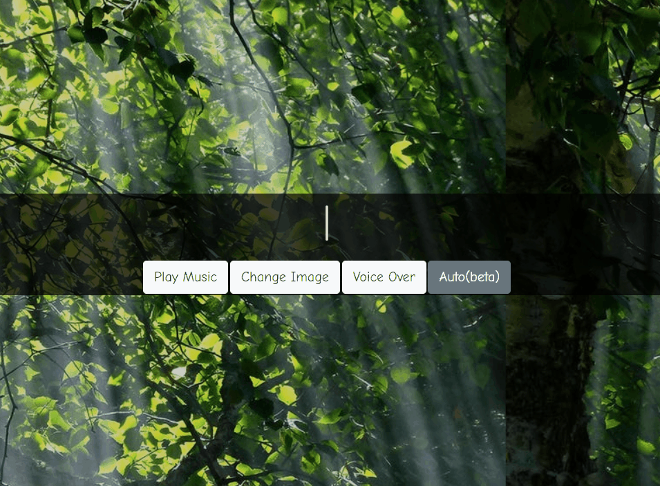

# Motivate me

An webapp that helps you to relax with encouraging motivation, relaxing music and auto voice-over. Built with **React**, **Adviceslip** and **Pexels** API.

## Description

This app generate random motivation from adviceslip API and gets you motivated with is relaxing and encouraging images from pelxels API. The relaxing music and auto voice-over helps you to relax while closing your eyes.
This simple project can help the beginners in React to practice different features of React as well as make something which is viable. This project will also get you started with API calls, react hooks and some other intermediate features of react.

## Installation

-   Clone the repo in your terminal by clicking the _green_ clone or download button at the top right and copyin the url
-   In your terminal, type `git clone URL`
    -   replace URL with the url you copied
    -   hit enter
-   This will copy all the files from this repo down to your computer
-   In your terminal, cd into the directory you just created
-   Type `npm install` to install all dependencies
-   Last, but not least, type `npm start` to run the app locally.

-   To look at the code, just open up the project in your favorite code editor!
